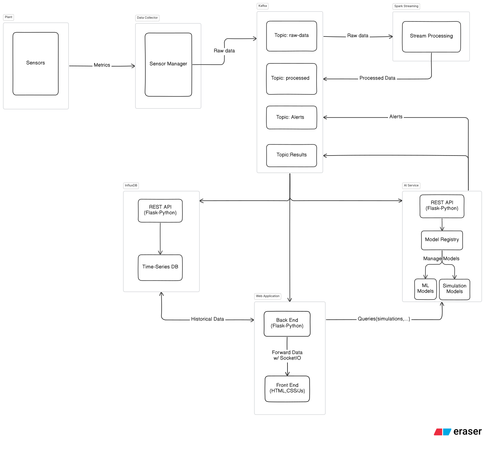
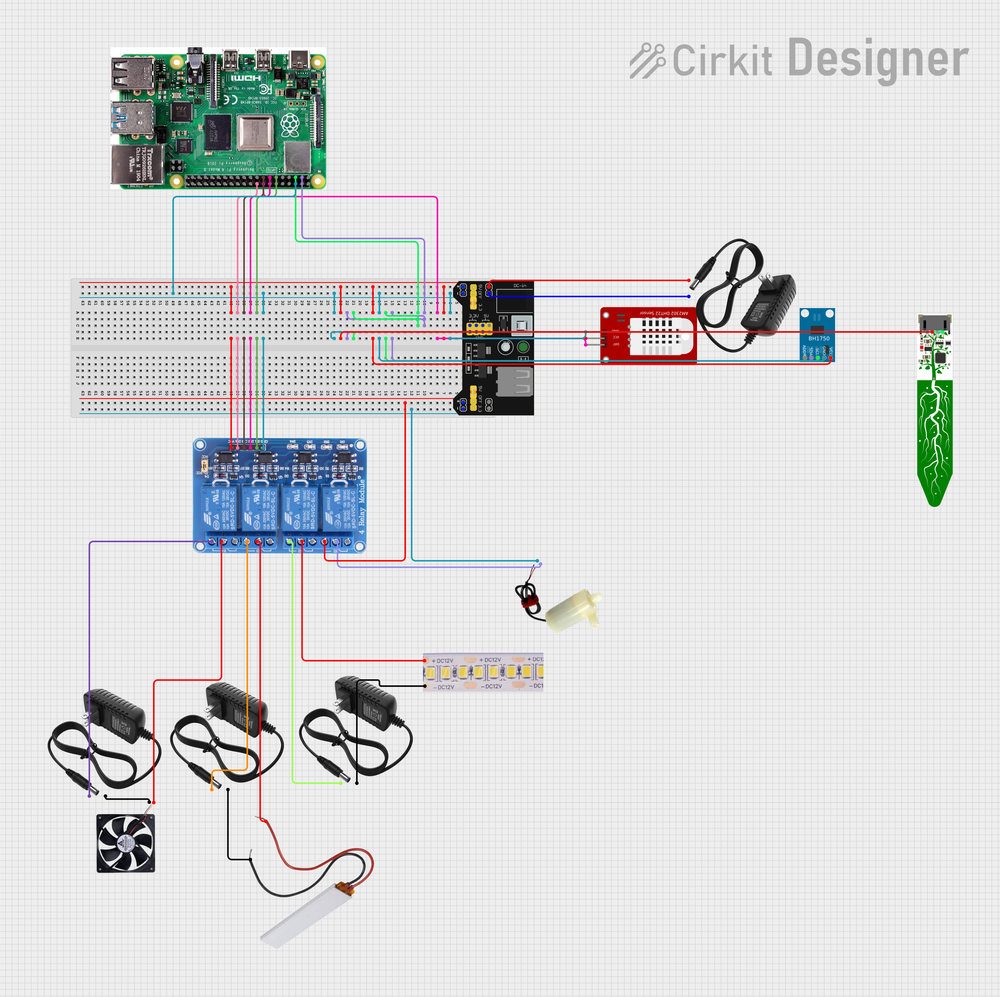
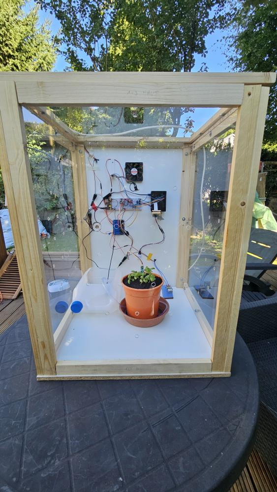
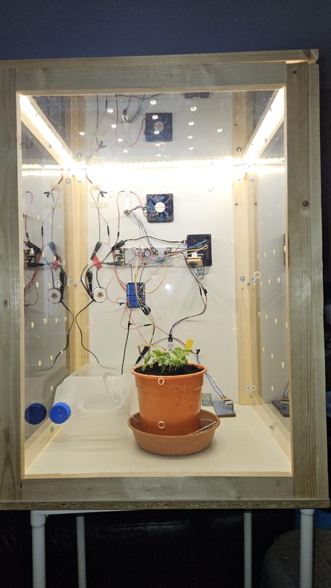
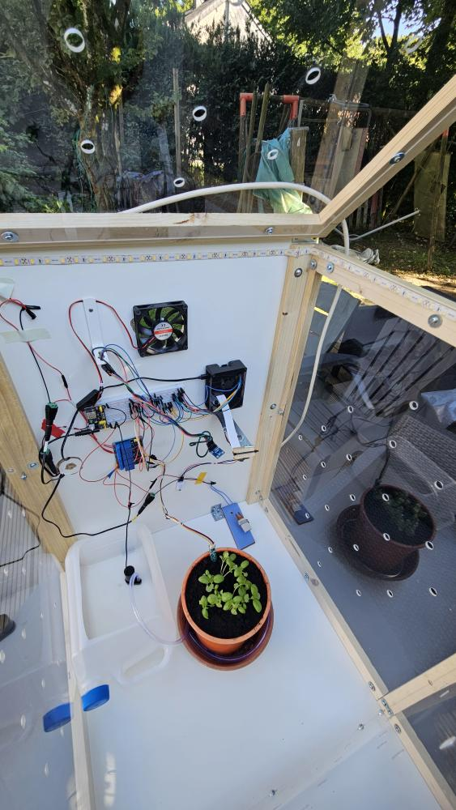

# Digital Twin for Plant Health Monitoring

A modular digital-twin stack for monitoring plant health. Physical sensors (DHT22, BH1750, STEMMA soil moisture, camera) feed a Raspberry Pi collector that publishes telemetry to Kafka. A Flask-based database service persists data into SQLite or InfluxDB, while the web dashboard streams live updates over Socket.IO. Supporting modules cover AI model management, utilities, setup automation, and hardware/software experiments.

---

## Key Capabilities

- Real-time telemetry collection from GPIO/I²C sensors with configurable read cadences.
- Kafka-backed messaging fabric with topic segregation for raw vs. processed sensor data.
- Database façade that bridges Kafka → InfluxDB (or SQLite fallback) and exposes REST endpoints.
- Interactive web dashboard (Flask + Socket.IO + Plotly) for live and historical visualisation.
- Early AI/model-registry scaffolding for future predictive and rule-based services.
- Provisioning scripts for Debian/Ubuntu hosts, Kafka KRaft nodes, and InfluxDB.
- Hands-on scripts to validate individual sensors, actuators, and platform services.

---

## System Architecture

 

## Hardware architecture


 
<!--Please include the following link, which help us continue to improve and support the embed, making it a valuable tool for your audience.--> <p style= "margin-top: 5px;" >Edit this project interactively in <a href="https://app.cirkitdesigner.com/project/a7f2e871-a131-4ed9-a017-cf650347826f" target = "_blank">Cirkit Designer</a>.</p>

### **Circuit Documentation**

#### **Component List**

1. **Adafruit STEMMA Soil Sensor**  
   * **Description**: Measures soil moisture levels.  
   * **Pins**: GND, VIN, SDA, SCL  
2. **BH1750**  
   * **Description**: Digital light sensor for measuring ambient light.  
   * **Pins**: VCC, GND, SCL, SDA, ADDR  
3. **12V White LED Strip**  
   * **Description**: Provides illumination.  
   * **Pins**: \+12V, GND  
4. **PTC**  
   * **Description**: Positive Temperature Coefficient heater for temperature control.  
   * **Pins**: Neutral, Live  
5. **FAN 12V**  
   * **Description**: Provides air circulation.  
   * **Pins**: RED, BLACK  
6. **5V Mini Water Pump**  
   * **Description**: Pumps water for irrigation.  
   * **Pins**: Positive pin, Negative pin  
7. **12V Power Supply**  
   * **Description**: Provides 12V power to various components.  
   * **Pins**: \+, \-  
8. **Raspberry Pi 4b**  
   * **Description**: Central processing unit for the system.  
   * **Pins**: Multiple GPIO pins, power, and communication interfaces  
9. **DHT22**  
   * **Description**: Measures temperature and humidity.  
   * **Pins**: GND, VCC, DAT  
10. **MB102 Breadboard Power Supply Module 3.3V/5V**  
    * **Description**: Provides 3.3V and 5V power outputs.  
    * **Pins**: VCC, GND, 3.3V, 5V  
11. **Relay 4 Channel 5V**  
    * **Description**: Controls high-power devices using low-power signals.  
    * **Pins**: GND, IN1, IN2, IN3, IN4, VCC, COM1, COM2, COM3, COM4, NO1, NO2, NO3, NO4, NC1, NC2, NC3, NC4

#### **Wiring Details**

##### **Adafruit STEMMA Soil Sensor**

* **GND**: Connected to MB102 Breadboard Power Supply Module GND  
* **VIN**: Connected to MB102 Breadboard Power Supply Module VCC  
* **SDA**: Connected to Raspberry Pi GPIO 2 SDA  
* **SCL**: Connected to Raspberry Pi GPIO 3 SCL

##### ---

**BH1750**

* **VCC**: Connected to MB102 Breadboard Power Supply Module VCC  
* **GND**: Connected to MB102 Breadboard Power Supply Module GND  
* **SDA**: Connected to Raspberry Pi GPIO 2 SDA  
* **SCL**: Connected to Raspberry Pi GPIO 3 SCL

##### ---

**12V White LED Strip**

* **\+12V**: Connected to Relay 4 Channel 5V COM2  
* **GND**: Connected to 12V Power Supply \-

##### ---

**PTC**

* **Neutral**: Connected to 12V Power Supply \-  
* **Live**: Connected to Relay 4 Channel 5V COM3

##### ---

**FAN 12V**

* **RED**: Connected to Relay 4 Channel 5V COM4  
* **BLACK**: Connected to 12V Power Supply \-

##### ---

**5V Mini Water Pump**

* **Positive pin**: Connected to Relay 4 Channel 5V COM1  
* **Negative pin**: Connected to MB102 Breadboard Power Supply Module GND

##### ---

**12V Power Supply**

* **\+**: Connected to various components through relays  
* **\-**: Connected to respective component grounds

##### ---

**Raspberry Pi 4b**

* **GPIO 2 SDA**: Connected to Adafruit STEMMA Soil Sensor SDA and BH1750 SDA  
* **GPIO 3 SCL**: Connected to Adafruit STEMMA Soil Sensor SCL and BH1750 SCL  
* **GPIO 17**: Connected to Relay 4 Channel 5V IN1  
* **GPIO 27**: Connected to Relay 4 Channel 5V IN2  
* **GPIO 22**: Connected to Relay 4 Channel 5V IN3  
* **GPIO 24**: Connected to Relay 4 Channel 5V IN4  
* **GND**: Connected to MB102 Breadboard Power Supply Module GND

##### ---

**DHT22**

* **GND**: Connected to MB102 Breadboard Power Supply Module GND  
* **VCC**: Connected to MB102 Breadboard Power Supply Module VCC  
* **DAT**: Connected to Raspberry Pi GPIO 23

##### ---

**MB102 Breadboard Power Supply Module 3.3V/5V**

* **VCC**: Connected to 12V Power Supply \+  
* **GND**: Connected to 12V Power Supply \-  
* **3.3V**: Not used in this configuration  
* **5V**: Not used in this configuration

##### ---

**Relay 4 Channel 5V**

* **GND**: Connected to MB102 Breadboard Power Supply Module GND  
* **VCC**: Connected to MB102 Breadboard Power Supply Module VCC  
* **IN1**: Connected to Raspberry Pi GPIO 17  
* **IN2**: Connected to Raspberry Pi GPIO 27  
* **IN3**: Connected to Raspberry Pi GPIO 22  
* **IN4**: Connected to Raspberry Pi GPIO 24  
* **COM1**: Connected to 5V Mini Water Pump positive pin  
* **NO1**: Connected to MB102 Breadboard Power Supply Module VCC  
* **COM2**: Connected to 12V White LED Strip \+12V  
* **NO2**: Connected to 12V Power Supply \+  
* **COM3**: Connected to PTC Live  
* **NO3**: Connected to 12V Power Supply \+  
* **COM4**: Connected to FAN 12V RED  
* **NO4**: Connected to 12V Power Supply \+

##### ---

### Physical Twin

 
 
 
---

## Repository Layout

| Path | Description |
| --- | --- |
| `dt/collector/` | GPIO/I²C sensor abstractions, mocks, and the `SensorManager` publishing to Kafka. |
| `dt/communication/` | Messaging clients (Kafka, MQTT) and REST API client for the database service. |
| `dt/data/database/` | Flask API for data persistence plus `SQLStorage` (SQLite) and `InfluxDBStorage`. |
| `dt/webapp/` | Flask + Socket.IO dashboard, Plotly front-end assets, templates, and real-time store. |
| `dt/ai/` | Model base class, metadata, registry, and filesystem storage backend (future analytics). |
| `dt/utils/` | Shared dataclasses, config enum, logging setup, correlation IDs, and exceptions. |
| `scripts/` | Provisioning scripts (`setup.sh`, `setup_kafka.sh`, `setup_influxdb.sh`), Kafka topic manager, and hands-on hardware/software experiments. |
| `tests/` | Pytest suite validating core dataclasses (serialization, helpers, validation). |
| `Makefile` | Convenience targets for installing poetry profiles, running services, tests, and maintenance. |
| `pyproject.toml` | Poetry project metadata, dependency groups (`dev`, `spark`, `db`, `rpi`), Python constraint (≥3.11,<4). |
| `connections.json` | SQLite connection helper used by local tooling (e.g., DB browsers). |
| `logs/` | Runtime logs generated by `dt.utils.logger.get_logger`. |

---

## Technology Stack

- **Runtime:** Python 3.11+, Poetry-managed environment.
- **Messaging:** Apache Kafka (`kafka-python`), optional MQTT (`paho-mqtt`).
- **Data Storage:** InfluxDB 2.x client (`influxdb-client`) and SQLite (`sqlite3`), with ready-made schema in `dt/data/database/db_init.sql`.
- **Web:** Flask, Flask-SocketIO, Flask-CORS, Plotly, vanilla JS modules.
- **Analytics:** Pandas, Matplotlib, model registry scaffolding for future ML integration.
- **Hardware I/O (optional group `rpi`):** `adafruit-circuitpython-*`, `adafruit-blinka`, `RPi.GPIO`, `board`, `busio`.
- **Optional Spark profile:** `pyspark`, `pyarrow`.
- **Dev Tooling (`dev` group):** pytest, ruff, mypy, basedpyright, debugpy, neovim helpers.

---

## Prerequisites

- Python 3.11 and Poetry (`curl -sSL https://install.python-poetry.org | python3 -`).
- Kafka broker (scripted install via `scripts/setup_kafka.sh` or existing cluster).
- InfluxDB 2.x (provision with `scripts/setup_influxdb.sh`), SQLite works out-of-the-box for development.
- Raspberry Pi OS (64-bit) for hardware deployment, with I²C/1-Wire/GPIO enabled.
- For Spark features, install Java 17 (handled inside `scripts/setup.sh`).

---

## Installation & Environment Profiles

Poetry extras mirror machine roles; the Makefile wraps recommended combinations:

| Target | Command | Included groups |
| --- | --- | --- |
| Development workstation | `make install-dev` | `main + dev + db + spark` |
| Raspberry Pi edge | `make install-rpi` | `main + rpi + db` |
| Data node | `make install-db` | `main + db` |
| Analytics | `make install-spark` | `main + spark (+db)` |
| Minimal | `make install-naked` | `main` |

Manual equivalent:

```bash
poetry install --with dev,db,spark --without rpi   # example for full dev stack
```

Activate the virtual environment with `poetry shell` or `make venv`.

---

## Configuration

Central settings live in `dt/utils/config.py` (StrEnum):

- `KAFKA_URL`: Kafka bootstrap servers (default `91.86.62.242:9092`; override for local clusters).
- `INFLUX_*`: URL, token, org, bucket for InfluxDB. Tokens in source are placeholders; supply your own secrets via environment variables or a secure config and modify the enum accordingly.
- `FLASK_*_URL`: Base URLs consumed by cross-service clients (`DatabaseApiClient`, web dashboard).
- `MODELS_DIR`: Registry storage path (default `../data/models/`).

Adjust these values before deploying. Keep credentials out of version control in production.

---

## Running the Stack

1. **Kafka topics**  
   - Use `scripts/kafka_manager.py setup` logic (or manually run `KafkaManager.setup_kafka()`) to create raw/processed sensor topics and supporting channels (alerts, commands).
   - Sensor topics follow `dt.sensors.<sensor>`, with `.raw` / `.processed` variants provided by `Topics`.

2. **Database service**  
   - `make run-database` → runs `dt/data/database/app.py`.
   - Subscribes to processed topics, persists payloads, and exposes REST endpoints:
     - `POST /bind_sensor` → register sensors (`SensorDescriptor`).
     - `POST /data/timestamp` → query by time range (`DBTimestampQuery`).
     - `POST /data/id` → fetch recent records by sensor ID (`DBIdQuery`).
   - Default storage backend is InfluxDB for time-series data. Later will be added SQL.

3. **Collector**  
   - `make run-collector` → runs `dt/collector/main.py`.
   - `SensorManager` composes sensor instances (Soil moisture, temperature, humidity, light, camera placeholder). Each sensor:
     - Implements `read_sensor` and `process_data`.
     - Declares `Topics` target (`.processed` currently used).
     - Publishes `SensorData` with correlation IDs, units, timestamps.
   - Binding to the database via `DatabaseApiClient.bind_sensor` exists but is commented while hardware pin mapping is in flux.

4. **Web dashboard**  
   - `make run-dashboard` → runs `dt/webapp/app.py`.
   - Sets up a Kafka consumer (`webapp_consumer_group`) and relays events to Socket.IO namespaces (`temperature`, `humidity`, `soil_moisture`, `light_intensity`, `camera_image`).
   - Front-end (`dt/webapp/static/js`) maintains a central store, displays live charts via Plotly, and merges historical data fetched from the database.

5. **Controller**  
   - Placeholder scaffolding for actuator management under `dt/controller/`. Base classes (`kinds/base_actuator.py`, etc.) are ready for future devices (fan, pump, light, relay). The `app.py` entrypoint is currently empty.

6. **AI / Analytics**  
   - `dt/ai` provides a `BaseModel`, metadata definitions, registry storage, and file-system persistence (`registry.json` + pickled models). Offline/online/rule-based categories are stubbed for expansion.

---

## Scripts & Hands-On Utilities

- `scripts/setup.sh`: Bootstraps Debian/Ubuntu host (Python, build tools, Java 17, Poetry, `poetry install`).
- `scripts/setup_kafka.sh`: Idempotent KRaft broker installer (creates `/opt/kafka`, systemd unit, external/internal listeners).
- `scripts/setup_influxdb.sh`: Installs and enables InfluxDB 2.x from the official apt repo.
- `scripts/kafka_manager.py`: CLI helper (`create`, `delete`, `list`, `describe`, `alter`, `config`, `setup_kafka`) built around `Topics`.
- `scripts/hands-on-scripts/hardware/`: Quick sensor/actuator tests (I²C scan, BH1750 lux reader, DHT22, Adafruit Seesaw soil probe, relay/pump control).
- `scripts/hands-on-scripts/software/`: Mini-clients for Kafka producer/consumer, InfluxDB write/read, Spark streaming example.
- `logs/`: Check runtime behaviour per-day (log files are auto-created).

Grant execute permission where necessary (`chmod +x scripts/setup_kafka.sh`).

---

## Testing & Quality

- Run `make test` or `poetry run pytest` (tests reside in `tests/utils/test_dataclasses.py`).
- Lint/type-check (if `dev` extras installed):
  - `poetry run ruff check .`
  - `poetry run mypy dt`
  - `poetry run basedpyright`
- Continuous logging assists in manual verification (`logs/plant_twin_<date>.log`).

---

## Development Notes & Extensibility

- All shared payloads use `dt.utils.dataclasses`:
  - `SensorData` enforces type conversion, JSON round-trips, `data_type` convenience.
  - `SensorDescriptor`, `DBTimestampQuery`, `DBIdQuery`, `ActionCommand` ensure consistent serialization.
- Topics are centralised in `dt/communication/topics.py`; prefer `.processed` topics until raw channel consumers exist.
- `dt/utils/ids.new_correlation_id()` creates UUIDs for end-to-end tracing (planned usage: readings → alerts → actions → audit trail).
- `dt/utils/logger.get_logger` writes to both stdout (INFO+) and rotating file (DEBUG). Avoid duplicate handler registration.
- For hardware changes, encapsulate sensor-specific logic in `dt/collector/kinds` and register through `SensorManager`.
- AI capabilities can evolve by implementing subclasses of `BaseModel` under `dt/ai/models/<category>/` and registering them via `ModelRegistry`.

---

## TODO

- Replace sensitive defaults in `dt/utils/config.py` with secure configuration management.
- Add an SQL managed database for non-time-series data (sensor registry, action history, alerts, ...).
- Configure the Downsampling task in InfluxDB for long-term data retention.
- Implement the data processing pipeline (consuming raw topics, enriching, publishing processed).
- Flesh out controller actuators and camera pipeline (currently placeholders).
- Close the loop with action commands (Kafka topic, REST endpoint, actuator control).
- Integrate AI models and registry once analytics logic is ready (tie into Kafka or database events).
- Enhance the web dashboard with more visualisations, historical queries, alert visualisation, and actuator controls, model status.
- Document production-grade deployment (systemd units, docker-compose, TLS for Kafka/Influx).
- Extend the test suite beyond dataclasses (e.g., messaging mocks, storage integrations).

---
