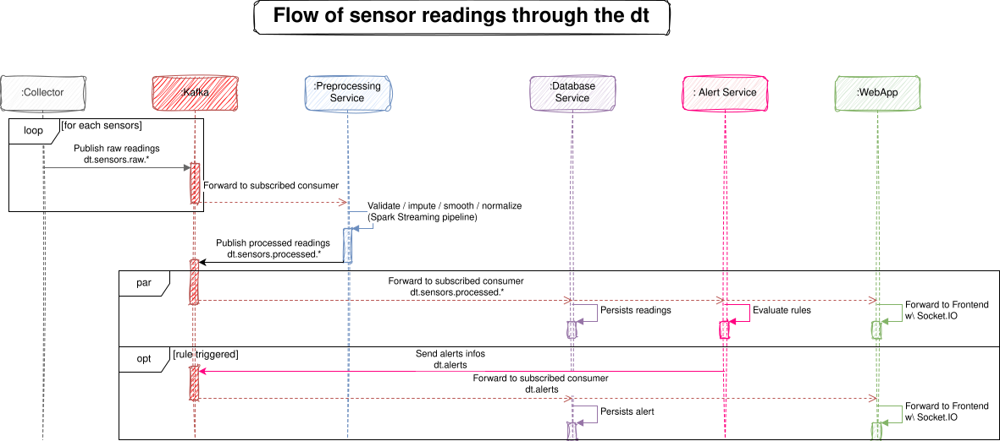
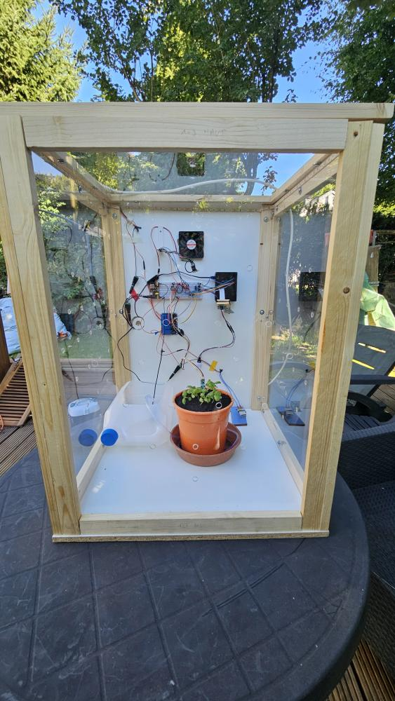
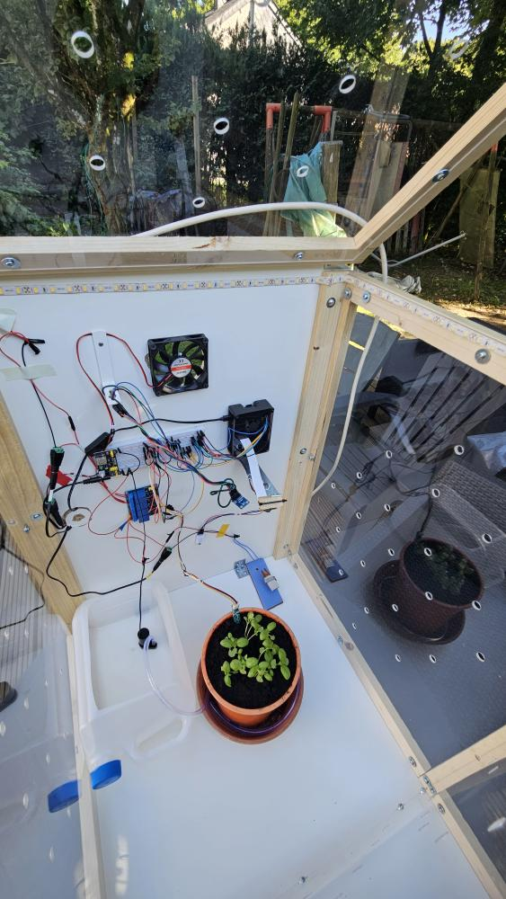

# Digital Twin for Plant Health Monitoring

This repository contains a modular digital twin for plant monitoring on
Raspberry Pi hardware. It collects live sensor readings, streams them through
Kafka, preprocesses them with Spark Structured Streaming, persists them in
PostgreSQL + TimescaleDB, evaluates alert rules, and exposes a web dashboard
for real-time and historical monitoring.

The current software stack is organized as a set of Python services under `dt/`
with Kafka for asynchronous data flow and REST APIs for queries and control
surfaces.


## What the project does

- Collects raw readings from physical sensors connected to a Raspberry Pi 4B.
- Publishes raw telemetry to Kafka topics.
- Runs a configurable preprocessing pipeline with calibration, validation, imputation, smoothing, and normalization.
- Persists processed readings and alert history in PostgreSQL + TimescaleDB.
- Evaluates alert rules and publishes alert lifecycle events.
- Serves a dashboard with live updates through Socket.IO and historical queries through REST.

## Main components

| Service | Path | Responsibility |
| --- | --- | --- |
| Collector | `dt/collector/` | Reads hardware sensors and publishes raw sensor events to Kafka. |
| Preprocessing | `dt/data/preprocess/` | Spark streaming job that transforms raw readings into processed readings. |
| Database service | `dt/data/database/` | Runs SQL migrations on startup, persists Kafka events, and exposes historical data APIs. |
| Alert engine (future analytics) | `dt/alerts/` | Evaluates alert rules, manages alert state, and publishes alert lifecycle events. |
| Web application | `dt/webapp/` | Dashboard UI, REST facade for the frontend, and Socket.IO real-time bridge. |
| Controller | `dt/controller/` | Actuator control service for pump, fan, heater, and light. |

## Data flow

The normal runtime path for a reading is:

1. The collector polls a physical sensor and publishes a raw event to a Kafka topic such as `dt.sensors.raw.temperature`.
2. The preprocessing job consumes raw sensor topics, applies the configured pipeline, and republishes the result to `dt.sensors.processed.*`.
3. The database service consumes processed sensor events and alert events, then stores them in PostgreSQL + TimescaleDB.
4. The alert engine consumes processed readings, evaluates YAML-defined rules, and publishes alert events to `dt.alerts`.
5. The controller consumes processed readings as well and evaluates routines rules for actuator control, publishing actions to `dt.actions`.
6. The web application consumes processed readings and alert events for live updates and queries the database service for historical data.



## Physical setup

The reference deployment is a Raspberry Pi 4B with:

- DHT22 for temperature and humidity
- BH1750 for light intensity
- Adafruit STEMMA soil moisture sensor
- Raspberry Pi Camera Module
- 4-channel relay
- Water pump, fan, heater, and LED strip

The I2C bus is shared by the BH1750 and STEMMA soil sensor on GPIO 2/3. The DHT22 data line is connected to GPIO 17. The relay channels are used to switch the actuators.




More detailed wiring and operational context live in [docs/runbook.pdf](docs/runbook.pdf).

## Repository layout

| Path | Purpose |
| --- | --- |
| `dt/` | Main application package and service modules |
| `dt/communication/` | Shared dataclasses, Kafka helpers, adapters, topic definitions, REST clients |
| `dt/utils/` | Configuration, logging, exceptions, YAML config files |
| `scripts/` | Provisioning scripts, Kafka utilities, SQL migration runner, hands-on scripts |
| `tests/` | Pytest suites organized by domain |
| `Makefile` | Convenience targets for installing poetry profiles, running services, tests, and maintenance. |
| `pyproject.toml` | Poetry project metadata, dependency groups (`dev`, `spark`, `db`, `rpi`), Python constraint (≥3.11,<4). |
| `.env.example`        | Example environment file for configuration.                                                                                     |
| `logs/`               | Runtime logs generated by `dt.utils.logger.get_logger`.                                                                         |
| `docs/img/` | Architecture diagrams, sequence diagrams, and hardware photos |

## Technology stack

- Python 3.11+
- Poetry for dependency management
- Apache Kafka for messaging
- PySpark Structured Streaming for preprocessing
- PostgreSQL + TimescaleDB for time-series and relational storage
- Flask + Flask-SocketIO for HTTP APIs and real-time dashboard updates
- Raspberry Pi hardware libraries in the optional `rpi` dependency group
- Svelete, TypeScript for the web dashboard frontend 

## Prerequisites

### Software

- Python 3.11+
- Poetry
- Kafka reachable at `KAFKA_URL`
- PostgreSQL with TimescaleDB reachable at `PG_DATABASE_URL`
- Java 17 if you run Kafka locally or use the preprocessing service
- Node.js and npm for frontend development (optional if you only want to run the backend services)

### Hardware

Hardware is only required for live sensor collection and actuator control. If you only want to explore the UI, APIs, or documentation, you can skip the physical setup and use dashboard demo mode.

## Installation

The repo uses Poetry dependency groups so you can install only what a given machine needs.

| Scenario | Command | Includes |
| --- | --- | --- |
| Development workstation | `make install-dev` | main + dev + db + spark |
| Raspberry Pi runtime | `make install-rpi` | main + rpi + db |
| Database-only node | `make install-db` | main + db |
| Preprocessing-only node | `make install-spark` | main + spark |
| Minimal Python environment | `make install-naked` | main |

If Poetry uses the wrong interpreter, point it at Python 3.11 explicitly:

```bash
poetry env use python3.11
```

Activate the virtual environment with `eval $(poetry env activate)` or `make venv`.
## Infrastructure setup

### Kafka

For Debian-based systems, the repository provides `scripts/setup_kafka.sh`. It installs Kafka in KRaft mode, configures a local broker, and registers a systemd service.

Useful checks after installation:

```bash
sudo systemctl status kafka-kraft.service
sudo journalctl -u kafka-kraft.service -f
nc -z localhost 9092
/opt/kafka/bin/kafka-topics.sh --bootstrap-server localhost:9092 --list
```

The repo also includes `scripts/kafka_manager.py` for listing, creating, and configuring topics.

### PostgreSQL + TimescaleDB

For Debian-based systems, use `scripts/setup_postgresql.sh`. It installs PostgreSQL and TimescaleDB, creates the application database and user, enables the extension, and writes `PG_DATABASE_URL` to `.env`.

The database schema is migration-driven. The database service runs migrations automatically on startup. You can also run them manually:

```bash
poetry run python scripts/run_sql_migration.py
```

## Configuration

Copy `.env.example` to `.env` and adjust the values for your environment.

Key variables:

| Variable | Purpose |
| --- | --- |
| `KAFKA_URL` | Kafka bootstrap server |
| `PG_DATABASE_URL` | PostgreSQL connection URL |
| `SQL_POOL_SIZE` | SQLAlchemy connection pool size |
| `FLASK_DASHBOARD_URL` | Webapp base URL |
| `FLASK_DB_URL` | Database service base URL |
| `FLASK_CONTROLLER_URL ` | Controller service base URL |
| `PREPROCESSING_CONFIG_PATH` | YAML config for preprocessing rules and profiles |
| `ALERT_RULES_PATH` | YAML alert rule file path |
| `PREPROCESSING_CHECKPOINT_DIR` | Spark checkpoint directory |
| `SPARK_APP_NAME` | Spark application name |
| `SPARK_STARTING_OFFSETS` | Kafka offset startup policy for preprocessing |
| `DB_MIGRATIONS_DIR` | SQL migrations directory override |

Configuration files used by the stack:

- `dt/utils/preprocessing_config.yml`
- `dt/utils/alert_rules.yml`

## Running the stack

Recommended service start order:

1. Start Kafka.
2. Start PostgreSQL + TimescaleDB.
3. Start the database service so migrations run and Kafka persistence is active.
4. Start the preprocessing service if you want processed sensor data.
5. Start the alert engine.
8. Start the controller only if you want actuator control.
7. Start the collector (but do not press ENTER yet) on the Raspberry Pi when hardware is available.
6. Start the web application and press ENTER in the collector terminal to begin sensor polling.

Make targets:

```bash
make run-database
make run-preprocessing
make run-alert-engine
make run-controller
make run-collector
make run-dashboard
```

### Demo mode

You can run the dashboard without Kafka or hardware by starting it in demo mode:

```bash
poetry run python -m dt.webapp.app --demo --demo-interval 1.0
```

### Service ports

| Service | Default port |
| --- | --- |
| Web dashboard | `5000` |
| Database service | `5001` |
| Alert engine | `5003` |
| Controller | `5004` |

## Messaging topics

The canonical topic definitions live in `dt/communication/topics.py`.

- Raw sensor topics: `dt.sensors.raw.*`
- Processed sensor topics: `dt.sensors.processed.*`
- Alerts: `dt.alerts`
- Actions: `dt.actions`

Examples:

- `dt.sensors.raw.temperature`
- `dt.sensors.processed.soil_moisture`
- `dt.alerts`

## Data and API conventions

- Backend dataclasses and database APIs use Unix epoch seconds for timestamps.
- The web UI uses milliseconds and converts at the API boundary.
- Standard sensor units are Celsius, percent, lux, and calibrated soil moisture percent.
- Correlation IDs are expected to propagate end-to-end for traceability.

## Development and testing

Primary commands:

```bash
make test
poetry run ruff check .
poetry run mypy dt
poetry run basedpyright
make build-webapp
```

Tests live under `tests/` and generally mirror the domain structure under `dt/`.

## Current status

This is an active thesis project, not a polished product distribution. The core architecture, storage layer, alert engine, and preprocessing pipeline are present, but parts of the system are still evolving:

- The controller service exists but the full closed-loop automation story (with analytics) is still in progress.
- Routines for actuator control based on sensor readings are working.
- The database module is complete with migrations, but needs to split the big TimescaleStorage class into more focused classes.
- Need to add an image processing module and move the camera storing out of the DB by using the filesystem.
- Need to modify retention and downsampling policies in TimescaleDB to balance storage and historical query needs.


## Further documentation

- [Runbook](docs/runbook.pdf): full operational documentation, interfaces, contracts, and module details
- [Presentations](docs/presentations/): project communication material

If you are new to the project, start with this README, then move to `docs/runbook.pdf` for deployment, operations, contracts, and troubleshooting details.
